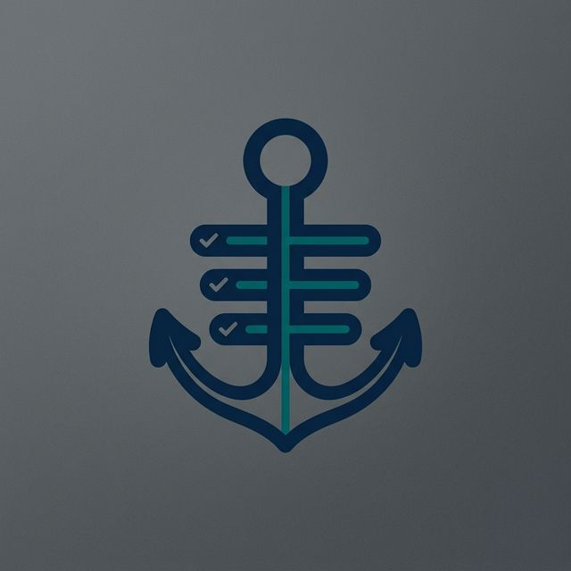

# Task Anchor

<p align="center">
  
</p>

<p align="center">
  <strong>ADHD executive function enforcement for Claude Desktop.</strong><br>
  An MCP server that transforms task management from a social contract<br>
  into a stateful boundary Claude cannot cross without explicit tool invocation.
</p>

<p align="center">
  <code>Python 3.11+</code> · <code>MIT License</code> · <code>96 tests</code> · <code>14 tools</code>
</p>

---

## Why this exists

ADHD developers don't lack ideas — they lack friction between ideas. A single "while we're at it" can derail an hour of focused work into a rabbit hole that felt productive but shipped nothing.

Task Anchor adds that friction mechanically. It creates a **task lock** that Claude must respect, runs **drift detection** on every message, and forces **explicit validation** before a task can be marked done. Ideas that surface mid-task are parked, not lost — they go into a safe queue you can review later.

The system also tracks emotional state across sessions. If you leave frustrated and come back the next morning, it knows, and it offers re-entry strategies instead of just dumping you back into the same wall.

---

## How it works

```
You say something → drift_detect scores it → drift? → park the idea, redirect
                                             clear? → continue working
                                                      ↓
                                              scope_validate_edit → in scope? → proceed
                                                                   out of scope? → block + offer options
                                                      ↓
                                              task_complete → evidence matches exit condition? → release lock
                                                             doesn't match? → reject, keep lock
```

Claude is required to follow these rules (enforced via `.claude/CLAUDE.md`):

1. **No code without a lock.** Claude refuses all coding help until `task_lock_create` defines what you're building, the exit condition, and the file scope.
2. **Drift detection on every message.** Every user input is scored against 26 weighted signal phrases (e.g., "while we're at it" = 5 points, "actually" = 2 points). Score ≥ 4 triggers an automatic park-and-redirect.
3. **Scope enforcement before edits.** Before modifying any file, Claude checks it against the locked scope. Out-of-scope edits are blocked.
4. **Session checkpoints before signing off.** Emotional state, next micro-action, and blocker notes are captured so the next session can resume intelligently.

---

## Setup

### Prerequisites

Python 3.11 or later. No other system dependencies.

### Install

```bash
cd mcp-server
pip install -e .
```

Or install just the runtime dependency without the package:

```bash
pip install mcp
```

### Configure Claude Desktop

Add to your `claude_desktop_config.json`:

```json
{
  "mcpServers": {
    "task-anchor": {
      "command": "python",
      "args": ["-m", "task_anchor.server"],
      "cwd": "/absolute/path/to/TaskAnchor/mcp-server"
    }
  }
}
```

If installed via pip:

```json
{
  "mcpServers": {
    "task-anchor": {
      "command": "task-anchor"
    }
  }
}
```

Restart Claude Desktop after saving.

---

## Tools

### Core enforcement

| Tool | Purpose |
|---|---|
| `task_lock_create` | Create a task lock with building goal, exit condition, and file scope |
| `task_lock_status` | Check current lock state — called at the start of every response |
| `drift_detect` | Score user input for context-switching signals; auto-parks if drift detected |
| `scope_validate_edit` | Verify a file is within the locked scope before allowing edits |
| `task_complete` | Validate completion evidence against exit condition; release lock if satisfied |

### Idea management

| Tool | Purpose |
|---|---|
| `parked_add` | Save an off-topic idea to `PARKED.md` with urgency and category |
| `parked_list` | List parked ideas — filter by `all`, `urgent`, or `current_session` |

### Session continuity

| Tool | Purpose |
|---|---|
| `session_checkpoint` | Save emotional state, next micro-action, and blocker note; creates a git commit |
| `session_resume` | Restore prior session context; detects stuck states and offers re-entry strategies |

### Personalisation

| Tool | Purpose |
|---|---|
| `set_tone` | Switch communication style: `strict`, `supportive` (default), or `minimal` |
| `get_tone` | Show current tone setting |
| `flow_mode_activate` | Suspend drift detection for a hyperfocus session (default 30 min, max 120) |
| `flow_mode_deactivate` | End flow mode early and re-enable drift detection |

### Analytics

| Tool | Purpose |
|---|---|
| `drift_history_log` | Record drift events for long-term ADHD self-monitoring and pattern analysis |

---

## Tone system

All user-facing messages route through a configurable tone layer. Same enforcement logic, different voice.

**Strict** — the original enforcement language.
```
⚓ DRIFT DETECTED (Score: 5/10)
ACTION REQUIRED: Call parked_add to capture this idea...
BINARY CHOICE:
[1] Park this idea and continue current task
[2] Mark current complete and switch (requires validation)
```

**Supportive** (default) — warm coaching voice, acknowledges effort, preserves agency.
```
⚓ New thread detected (score: 5/10)
That sounds like a separate idea — and it might be a good one.
Let me save it so you don't lose it.
What would you like to do?
[1] Park this idea — I'll save it, and we keep going
[2] This IS more important — let's switch (finish current first)
```

**Minimal** — facts only, shortest possible output.
```
Drift (score 5/10): "while we're at it let's..."
[1] Park  [2] Switch
```

Switch at any time with `set_tone`.

---

## Flow mode

When you're in hyperfocus and the drift detection is getting in the way, activate flow mode:

```
flow_mode_activate(duration_minutes=45)
```

Drift detection is suspended. Scope enforcement stays active (safety net, not a cage). The mode auto-expires after the set duration and sends a gentle check-in. End early with `flow_mode_deactivate`.

Maximum duration is 120 minutes — even hyperfocus benefits from periodic check-ins.

---

## Architecture

```
mcp-server/
├── pyproject.toml
└── task_anchor/
    ├── config.py           — path resolution (immune to cwd, env-overridable)
    ├── models.py           — TaskLock dataclass, drift signal weights + thresholds
    ├── storage.py          — atomic file I/O, cross-platform locking (fcntl/msvcrt)
    ├── drift.py            — scoring engine, completion validation, history logging
    ├── flow.py             — flow mode activate/deactivate/auto-expire
    ├── tone.py             — tone persistence + message resolver
    ├── messages.py         — message registry (aggregator)
    ├── messages_core.py    — templates: lock, drift, parked, scope
    ├── messages_session.py — templates: completion, session, flow, celebration
    ├── helpers.py          — shared utilities (git branch, load lock, session log)
    ├── streak.py           — daily streak tracking, completion celebration
    ├── tools.py            — MCP tool schema definitions (14 tools)
    ├── handlers.py         — tool handler coroutines
    └── server.py           — MCP wiring, route table, entry point
```

### State files

All state lives in `.claude/skills/task-anchor/` inside the repo root. Override with `TASK_ANCHOR_DIR`.

| File | Purpose |
|---|---|
| `TASK_LOCK.json` | Active task lock (building, exit condition, scope, timestamp) |
| `SESSION.json` | Last session snapshot (emotional state, next action, blocker) |
| `SESSION_LOG.md` | Human-readable session history |
| `PARKED.md` | Append-only log of parked ideas with urgency and timestamp |
| `DRIFT_HISTORY.json` | Drift event statistics (total drifts, successful interventions) |
| `STREAK.json` | Daily completion streak (current, longest, history) |
| `TONE.json` | User's tone preference |
| `FLOW_MODE.json` | Active flow mode state with expiry timestamp |

### Design decisions

**Why MCP, not a prompt injection?** Prompt injections are social contracts — Claude can be talked out of them. MCP tools are stateful boundaries. Claude literally cannot mark a task complete without calling `task_complete`, which validates evidence against the exit condition before releasing the lock.

**Why word-boundary regex instead of substring matching for drift detection?** "Rewrite" appearing inside "overwrite" is not a drift signal. "Instead" appearing inside "instantiate" is not a drift signal. Whole-word boundary matching prevents false positives from normal technical language.

**Why naive stemming instead of a real NLP library?** Zero additional dependencies. The stemmer handles the 90% case (plurals, -ing, -ed, -tion, -ly) that matters for matching exit conditions like "test passes" against evidence like "tests passed." A full NLP stack would add weight for marginal accuracy gain.

**Why three tones?** ADHD is not one experience. Some people respond to external structure ("VIOLATION: Cannot proceed"). Others find that language triggering, especially those with rejection sensitive dysphoria. A configurable tone means the same enforcement logic works for different brains.

---

## Testing

```bash
cd mcp-server
pip install -e ".[test]"
pytest tests/ -v
```

96 tests across 4 test files covering drift scoring, completion validation, model serialisation, scope validation, session filtering, tone switching, flow mode, and all 14 handler coroutines.

---

## Environment variables

| Variable | Default | Purpose |
|---|---|---|
| `TASK_ANCHOR_DIR` | `<repo>/.claude/skills/task-anchor` | Override state file location |
| `TASK_ANCHOR_SILENT` | unset | Set to `1` to suppress completion celebration output |

---

## License

MIT
